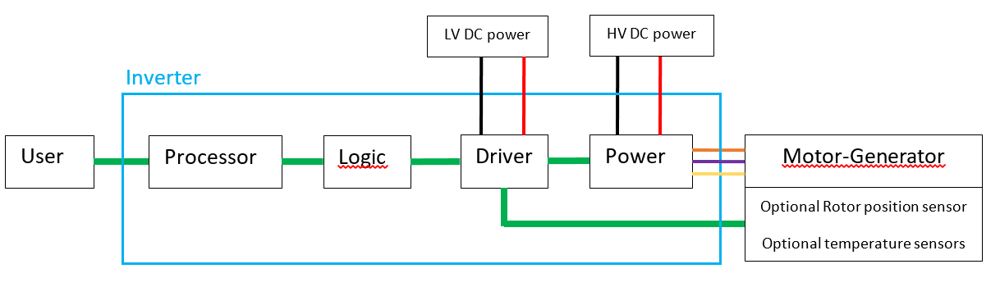

# MANGI

MANGI = Modular Architecture for Motor-Generator Inverter

# Related keywords
ESC (Electronic Speed Controller), PMSM, BLDC, AC/DC Inverter, Electrical machine

# Scope
Specify a modular architecture for electric motor-generator inverters.

The specification defines:
-	The architecture diagram
-	The functions provides by each block
-	The interfaces between each block: functional, electrical and possibly mechanical (where it make sense)

Therefore this repository is a “documentation only” repository that should be the base for other projects implementing this specification.

Initially, you can get involved by helping to write this specification.

Later you will be able to get involved by designing a block of the inverter. 

# Applications
A design/architecture is always a trade-off between many factors:
-	Performance / Features
-	Development time
-	Cost of a system / hardware components costs
-	Maintenance cost
-	Etc.

Due to its trade-off / choices, this architecture is mostly optimized for:
- High power (>”1-10”kW) electric motor-generators
- In particular, for applications were electrical insulation is required due to the use of a high (>”50-100”V) DC voltage
- Permanent magnet brushless motor-generators (+ possibly other types of motor-generators)

Application examples:
- Inverter for electric vehicle: car / plane / etc.
- Inverter for high power water pump
- Inverter for wind turbine

#	Motivations

#1 = Stop “reinventing the wheel” each time a new inverter is needed.

#2 = Collaborative:     A high power inverter is a complex design that will benefit from a modular architecture by allowing contribution from people with various expertise (software programing, FPGA design, hardware design, motor-generator control, electrical safety, etc.)

#3 = Maintenance:   The modularity of the inverter helps its maintenance. Even if a part/component becomes obsolete, it is easier / cheaper to replace/redesign a block rather than the whole inverter.

#4 = Longevity:     The technologies selected/targeted should be available during a long period of time (>> 20 years) from many suppliers (/semiconductor manufacturer)

#	Architecture diagram
The inverter is divided in 4 blocks:
- Processor block
- Logic block
- Driver block
- Power block

 

